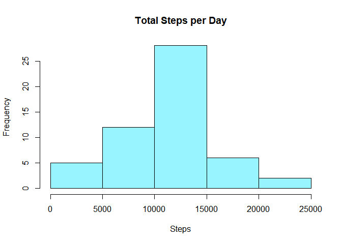
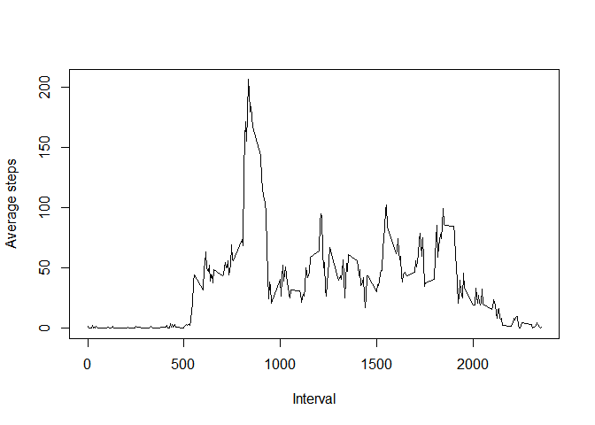
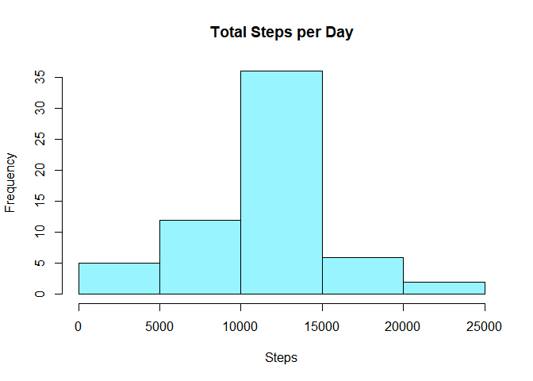
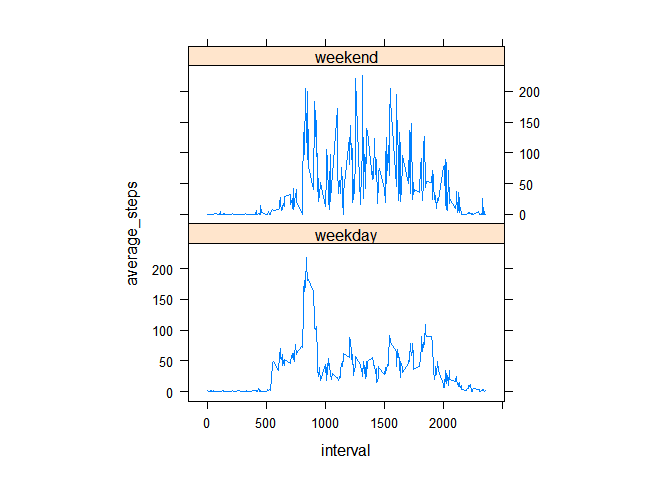

## Part 1: Loading and pre-processing the data

When we fork the [GITHUB directory](https://github.com/rdpeng/RepData_PeerAssessment1) provided in the assignment and load a version control into R Studio we can automatically view the activity.zip file has been loaded into the Project folder.


```r
# Unzip the activity.zip file
unzip("activity.zip")

# Read in the resulting activity.csv
activity <- read.csv("activity.csv")

# Take a look at the data format 
str(activity)
```

```
## 'data.frame':	17568 obs. of  3 variables:
##  $ steps   : int  NA NA NA NA NA NA NA NA NA NA ...
##  $ date    : chr  "2012-10-01" "2012-10-01" "2012-10-01" "2012-10-01" ...
##  $ interval: int  0 5 10 15 20 25 30 35 40 45 ...
```
From the overview, we can see that the Date is formatted as a character. For future use, we will change the character date to a Date object using an as.Date function. 


```r
activity$date <- as.Date(activity$date, format = "%Y-%m-%d")
str(activity) 
```

```
## 'data.frame':	17568 obs. of  3 variables:
##  $ steps   : int  NA NA NA NA NA NA NA NA NA NA ...
##  $ date    : Date, format: "2012-10-01" "2012-10-01" ...
##  $ interval: int  0 5 10 15 20 25 30 35 40 45 ...
```


## Part 2: What is the mean total number of steps taken per day?

For summing up the number of steps per day, we will make use of summarise in the dplyr package


```r
# Load data
library(dplyr)
```

```
## 
## Attaching package: 'dplyr'
```

```
## The following objects are masked from 'package:stats':
## 
##     filter, lag
```

```
## The following objects are masked from 'package:base':
## 
##     intersect, setdiff, setequal, union
```

```r
# View data structure
head(activity)
```

```
##   steps       date interval
## 1    NA 2012-10-01        0
## 2    NA 2012-10-01        5
## 3    NA 2012-10-01       10
## 4    NA 2012-10-01       15
## 5    NA 2012-10-01       20
## 6    NA 2012-10-01       25
```


```r
# Sum of steps ignoring NAs
steps_per_day <- activity[!is.na(activity$steps),] %>%  
    group_by(date) %>% summarise(total_steps = sum(steps))

head(steps_per_day)
```

```
## # A tibble: 6 x 2
##   date       total_steps
##   <date>           <int>
## 1 2012-10-02         126
## 2 2012-10-03       11352
## 3 2012-10-04       12116
## 4 2012-10-05       13294
## 5 2012-10-06       15420
## 6 2012-10-07       11015
```

```r
# Drawing a histogram of total steps per day
hist(steps_per_day$total_steps, main = "Total Steps per Day", xlab = "Steps", col = "cadetblue1")
```

<!-- -->

```r
# Mean of total steps
mean(steps_per_day$total_steps)
```

```
## [1] 10766.19
```


```r
# Median of total steps
median(steps_per_day$total_steps)
```

```
## [1] 10765
```
From the results we can see that the mean is `mean(steps_per_day$total_steps)` and median is `median(steps_per_day$total_steps)`. The values are nearly identical. 

## Part 3: What is the average daily activity pattern?

Like with the previous exercise, we use the dplyr package to find the mean of steps per interval and proceed to plot it.


```r
# Mean of steps per interval
steps_per_interval <- activity %>%  
    group_by(interval) %>% summarise(average_steps = mean(steps, na.rm = TRUE))

# View results
head(steps_per_interval)
```

```
## # A tibble: 6 x 2
##   interval average_steps
##      <int>         <dbl>
## 1        0        1.72  
## 2        5        0.340 
## 3       10        0.132 
## 4       15        0.151 
## 5       20        0.0755
## 6       25        2.09
```

```r
# Plot average steps of interval 
plot(steps_per_interval$interval, steps_per_interval$average_steps, type = "l", xlab = "Interval", ylab = "Average steps")
```

<!-- -->

```r
# Find the maximum number of steps
steps_per_interval[steps_per_interval$average_steps == max(steps_per_interval$average_steps),]
```

```
## # A tibble: 1 x 2
##   interval average_steps
##      <int>         <dbl>
## 1      835          206.
```
Finally by subsetting that row that contains the maximum mean number of steps, we can identify the interval where the maximum number of average_steps occurs is interval 835. 


## Part 4: Imputing missing values

First, we will identify the rows with NA values. 


```r
# Counting the number of rows with NA 
table(is.na(activity$steps))
```

```
## 
## FALSE  TRUE 
## 15264  2304
```
From the table, we can see that there are 2304 NA values in the number of steps in the activity dataset. 

To impute the values we will choose to fill in the values with the mean number of steps if the given time interval. 


```r
# Merged dataset with steps_per_interval to fill in given condition
merged_interval <- merge(activity, steps_per_interval, by = "interval")
head(merged_interval)
```

```
##   interval steps       date average_steps
## 1        0    NA 2012-10-01      1.716981
## 2        0     0 2012-11-23      1.716981
## 3        0     0 2012-10-28      1.716981
## 4        0     0 2012-11-06      1.716981
## 5        0     0 2012-11-24      1.716981
## 6        0     0 2012-11-15      1.716981
```


```r
# Fill in NA's with the mean of steps per interval
merged_interval$steps <- ifelse(is.na(merged_interval$steps), merged_interval$average_steps, merged_interval$steps)   
```


```r
# Remove the average_steps column
merged_interval <- merged_interval[, 1:3]
head(merged_interval)
```

```
##   interval    steps       date
## 1        0 1.716981 2012-10-01
## 2        0 0.000000 2012-11-23
## 3        0 0.000000 2012-10-28
## 4        0 0.000000 2012-11-06
## 5        0 0.000000 2012-11-24
## 6        0 0.000000 2012-11-15
```


```r
# Mean of steps per interval
imputed_steps <- merged_interval %>%  
    group_by(date) %>% summarise(total_steps = sum(steps))

head(imputed_steps)
```

```
## # A tibble: 6 x 2
##   date       total_steps
##   <date>           <dbl>
## 1 2012-10-01      10766.
## 2 2012-10-02        126 
## 3 2012-10-03      11352 
## 4 2012-10-04      12116 
## 5 2012-10-05      13294 
## 6 2012-10-06      15420
```


```r
# Drawing a histogram of total steps per day
hist(imputed_steps$total_steps, main = "Total Steps per Day", xlab = "Steps", col = "cadetblue1")
```

<!-- -->


```r
# Compute the mean of steps
mean(imputed_steps$total_steps)
```

```
## [1] 10766.19
```

```r
# Compute the median of steps
median(imputed_steps$total_steps)
```

```
## [1] 10766.19
```

## Part 4: Are there differences in activity patterns between weekdays and weekends? 


```r
# Adding a factor column - weekday, weekend 
merged_interval$weekday <- ifelse(weekdays(merged_interval$date) == c("Sunday", "Saturday"), 'weekend', 'weekday')

# Treating weekday as a factor
merged_interval$weekday <- as.factor(merged_interval$weekday)

head(merged_interval)
```

```
##   interval    steps       date weekday
## 1        0 1.716981 2012-10-01 weekday
## 2        0 0.000000 2012-11-23 weekday
## 3        0 0.000000 2012-10-28 weekend
## 4        0 0.000000 2012-11-06 weekday
## 5        0 0.000000 2012-11-24 weekday
## 6        0 0.000000 2012-11-15 weekday
```

```r
# Mean of steps per interval
steps_per_weekday <- merged_interval %>%  
    group_by(interval, weekday) %>% summarise(average_steps = mean(steps))
```

```
## `summarise()` has grouped output by 'interval'. You can override using the `.groups` argument.
```

```r
# View results
head(steps_per_weekday)
```

```
## # A tibble: 6 x 3
## # Groups:   interval [3]
##   interval weekday average_steps
##      <int> <fct>           <dbl>
## 1        0 weekday         1.94 
## 2        0 weekend         0.215
## 3        5 weekday         0.406
## 4        5 weekend         0    
## 5       10 weekday         0.149
## 6       10 weekend         0
```
Because this is creating a panel plot, we will use the lattice plot to display this. 

```r
library(lattice)
```

```r
xyplot(average_steps ~ interval | weekday, data = steps_per_weekday, type = "l", aspect = 1/2)
```

<!-- -->

